# 🗺️ ft_traceroute - Implementación del Comando Traceroute en C

<div align="center">


**Una implementación completa y educativa del comando UNIX `traceroute` desde cero**

[Características](#-características) • [Instalación](#-instalación) • [Uso](#-uso) • [Teoría](#-fundamentos-teóricos) • [Implementación](#-implementación)

</div>

---

## 📋 Tabla de Contenidos

- [Introducción](#-introducción)
- [Características](#-características)
- [Requisitos](#-requisitos)
- [Instalación](#-instalación)
- [Uso](#-uso)
- [Fundamentos Teóricos](#-fundamentos-teóricos)
  - [¿Qué es Traceroute?](#-qué-es-traceroute)
  - [¿Cómo Funciona Traceroute?](#-cómo-funciona-traceroute)
  - [TTL (Time To Live)](#-ttl-time-to-live)
  - [Protocolo UDP vs ICMP](#-protocolo-udp-vs-icmp)
  - [Tipos de Mensajes ICMP Relevantes](#-tipos-de-mensajes-icmp-relevantes)
  - [Resolución DNS Inversa](#-resolución-dns-inversa)
  - [Path MTU Discovery](#-path-mtu-discovery)
- [Implementación del Proyecto](#-implementación-del-proyecto)
  - [Arquitectura](#arquitectura)
  - [Diagrama de Flujo](#diagrama-de-flujo-completo)
  - [Estructuras de Datos](#estructuras-de-datos)
  - [Módulos y Funciones](#módulos-y-funciones)
  - [Diferencias con Ping](#diferencias-con-ping)
- [Ejemplos de Uso](#-ejemplos-de-uso)
- [Referencias](#-referencias)

---

## 🎯 Introducción

**ft_traceroute** es una reimplementación educativa del comando UNIX `traceroute` escrita en C puro. Este proyecto no solo replica la funcionalidad del traceroute estándar, sino que sirve como una herramienta didáctica completa para comprender el enrutamiento de paquetes en Internet, el protocolo ICMP y cómo los paquetes viajan a través de múltiples routers (hops) hasta llegar a su destino.

El comando `traceroute` es una herramienta fundamental de diagnóstico de red que permite:
- 🗺️ **Trazar la ruta** que siguen los paquetes a través de Internet
- 🔍 **Identificar routers intermedios** en el camino al destino
- 📊 **Medir latencia** en cada salto (hop)
- 🚫 **Detectar problemas de enrutamiento** y puntos de fallo
- 🌐 **Visualizar la topología** de la red

---

## ✨ Características

### Características Principales
- ✅ **Trazado de ruta completo** usando paquetes UDP
- ✅ **Incremento progresivo de TTL** (de 1 hasta max_ttl)
- ✅ **Múltiples probes por hop** (configurable con `-q`)
- ✅ **Recepción de respuestas ICMP**: Time Exceeded y Port Unreachable
- ✅ **Resolución DNS inversa** de las IPs de los routers
- ✅ **Cálculo de RTT** (Round Trip Time) por probe
- ✅ **Detección de destino alcanzado** (ICMP Port Unreachable)
- ✅ **Soporte para IPv4**
- ✅ **Manejo de timeouts** y paquetes perdidos

### Opciones Implementadas
| Flag | Descripción | Default |
|------|-------------|---------|
| `-m <max_ttl>` | Número máximo de saltos (hops) | 30 |
| `-q <num_probes>` | Número de paquetes por hop | 3 |
| `-p <port>` | Puerto UDP base | 33434 |
| `--help` | Muestra la ayuda | - |

---

## 🔧 Requisitos

- **Sistema Operativo**: Linux/Unix
- **Compilador**: GCC o Clang con soporte C99
- **Permisos**: Root o CAP_NET_RAW (para crear raw sockets)
- **Librerías**:
  - `libc` estándar
  - Headers de red: `<netinet/ip.h>`, `<netinet/ip_icmp.h>`, `<netinet/udp.h>`

---

## 📦 Instalación

```bash
# Navegar al directorio del proyecto
cd ft_traceroute

# Compilar el proyecto
make

# Ejecutar (requiere permisos de root)
sudo ./ft_traceroute google.com
```

### Compilación con Opciones
```bash
# Limpiar archivos objeto
make clean

# Limpiar todo (incluido binario)
make fclean

# Recompilar desde cero
make re
```

---

## 🚀 Uso

### Sintaxis Básica
```bash
sudo ./ft_traceroute [opciones] <destino>
```

### Ejemplos Básicos

```bash
# Traceroute básico a un hostname
sudo ./ft_traceroute google.com

# Traceroute a una IP
sudo ./ft_traceroute 8.8.8.8

# Limitar a 15 saltos máximo
sudo ./ft_traceroute -m 15 google.com

# Enviar 5 probes por hop
sudo ./ft_traceroute -q 5 google.com

# Puerto UDP personalizado
sudo ./ft_traceroute -p 40000 google.com

# Combinar opciones
sudo ./ft_traceroute -m 20 -q 5 google.com
```

### Salida Esperada
```
ft_traceroute to google.com (142.250.185.46), 30 hops max, 60 byte packets
 1  192.168.1.1  1.234 ms  1.123 ms  1.089 ms
 2  10.243.0.1  5.678 ms  5.456 ms  5.321 ms
 3  * * *
 4  72.14.232.85  15.234 ms  15.123 ms  15.098 ms
 5  142.251.61.221  16.345 ms  16.234 ms  16.123 ms
 6  142.250.185.46  18.456 ms  18.345 ms  18.234 ms
```

**Interpretación de la salida:**
- **Columna 1**: Número de hop (distancia en routers)
- **Columna 2**: IP o hostname del router
- **Columnas 3-5**: RTT de cada probe en milisegundos
- **`* * *`**: Indica que el router no respondió (timeout)

---

## 📚 Fundamentos Teóricos

### 🗺️ ¿Qué es Traceroute?

**Traceroute** es una utilidad de diagnóstico de red que traza la ruta que toman los paquetes desde el origen hasta un destino a través de una red IP. A diferencia de `ping` que solo verifica conectividad punto a punto, traceroute muestra todos los routers intermedios (saltos o "hops") en el camino.

#### Aplicaciones Prácticas:
- 🔧 **Diagnóstico de problemas de red**: Identificar dónde se pierde la conectividad
- 📊 **Análisis de latencia**: Ver qué saltos añaden más delay
- 🌍 **Visualización de topología**: Entender cómo está organizada la red
- 🚫 **Detección de rutas subóptimas**: Encontrar caminos ineficientes
- 🔒 **Auditoría de seguridad**: Identificar firewalls y routers en la ruta

---

### ⚙️ ¿Cómo Funciona Traceroute?

Traceroute utiliza una técnica ingeniosa basada en el campo **TTL (Time To Live)** del protocolo IP y los mensajes de error ICMP.

#### Principio Fundamental:

```
┌─────────────────────────────────────────────────────────────────┐
│  Cada router decrementa el TTL en 1                             │
│  Si TTL llega a 0, el router envía ICMP Time Exceeded           │
│  Traceroute usa esto para descubrir cada hop                    │
└─────────────────────────────────────────────────────────────────┘
```

#### Proceso Detallado:

```
┌──────────┐                                                  ┌──────────┐
│  Origen  │                                                  │ Destino  │
│  (Host)  │                                                  │(8.8.8.8) │
└────┬─────┘                                                  └────┬─────┘
     │                                                             │
     │  1. Enviar paquete UDP con TTL=1                           │
     ├─────────────────────>┌──────────┐                         │
     │                      │ Router 1 │                         │
     │                      └────┬─────┘                         │
     │                           │ TTL=1-1=0 → Descarta          │
     │                           │                                │
     │  ICMP Time Exceeded       │                                │
     <───────────────────────────┤                                │
     │  From: Router 1 IP        │                                │
     │                           │                                │
     │  ✓ Router 1 descubierto   │                                │
     │                           │                                │
     │  2. Enviar paquete UDP con TTL=2                           │
     ├─────────────────────>┌──────────┐                         │
     │                      │ Router 1 │ TTL=2-1=1                │
     │                      └────┬─────┘                         │
     │                           ├─────────>┌──────────┐          │
     │                           │          │ Router 2 │          │
     │                           │          └────┬─────┘          │
     │                           │               │ TTL=1-1=0      │
     │                           │               │ → Descarta     │
     │                           │               │                │
     │  ICMP Time Exceeded       │               │                │
     <───────────────────────────────────────────┤                │
     │  From: Router 2 IP        │               │                │
     │                           │               │                │
     │  ✓ Router 2 descubierto   │               │                │
     │                           │               │                │
     │  3. Enviar paquete UDP con TTL=3                           │
     ├─────────────────────>┌──────────┐                         │
     │                      │ Router 1 │ TTL=3-1=2                │
     │                      └────┬─────┘                         │
     │                           ├─────────>┌──────────┐          │
     │                           │          │ Router 2 │ TTL=2-1=1│
     │                           │          └────┬─────┘          │
     │                           │               ├────────────────>
     │                           │               │                │ TTL=1
     │                           │               │         ┌──────▼────┐
     │                           │               │         │  Destino  │
     │                           │               │         │  8.8.8.8  │
     │                           │               │         └─────┬─────┘
     │                           │               │               │
     │                           │               │               │ Puerto UDP
     │                           │               │               │ no existe
     │                           │               │               │
     │  ICMP Port Unreachable    │               │               │
     <─────────────────────────────────────────────────────────┤
     │  From: Destino IP         │               │               │
     │                           │               │               │
     │  ✓ Destino alcanzado      │               │               │
     │  → FIN                    │               │               │
     ▼                           ▼               ▼               ▼
```

#### Pasos del Algoritmo:

**Para TTL = 1, 2, 3, ..., max_ttl:**

1. **Enviar paquete UDP**:
   - Destino: IP/hostname objetivo
   - Puerto: 33434 + TTL (o personalizado con `-p`)
   - TTL: Valor incremental (1, 2, 3, ...)
   - Payload: 40 bytes de datos

2. **Esperar respuesta ICMP**:
   - **ICMP Time Exceeded (Type 11, Code 0)**: Router intermedio
     - Guardar IP del router
     - Calcular RTT
     - Este es el hop TTL
   - **ICMP Port Unreachable (Type 3, Code 3)**: Destino alcanzado
     - ¡Llegamos al destino!
     - Terminar traceroute
   - **Timeout**: No hay respuesta
     - Mostrar `*` en la salida

3. **Repetir N veces por hop** (configurable con `-q`):
   - Por defecto: 3 probes por hop
   - Permite medir variabilidad de latencia
   - Mejora fiabilidad ante pérdida de paquetes

4. **Mostrar resultado del hop**:
   - Número de hop
   - IP/hostname del router (con DNS inverso)
   - RTTs de cada probe

5. **Condiciones de parada**:
   - Se alcanzó el destino (ICMP Port Unreachable)
   - Se llegó al max_ttl (por defecto 30)

---

### ⏱️ TTL (Time To Live)

El **TTL (Time To Live)** es un campo de 8 bits en el header IP que limita el tiempo de vida de un paquete en la red.

#### Estructura del Header IP con TTL:

```
 0                   1                   2                   3
 0 1 2 3 4 5 6 7 8 9 0 1 2 3 4 5 6 7 8 9 0 1 2 3 4 5 6 7 8 9 0 1
┌───────┬───────┬───────────────┬───────────────────────────────┐
│Version│  IHL  │Type of Service│        Total Length           │
├───────────────────────────────┼───────┬───────────────────────┤
│       Identification          │ Flags │   Fragment Offset     │
├───────────────┬───────────────┴───────┴───────────────────────┤
│      TTL      │    Protocol   │       Header Checksum         │
├───────────────┴───────────────┴───────────────────────────────┤
│                     Source IP Address                         │
├───────────────────────────────────────────────────────────────┤
│                  Destination IP Address                       │
└───────────────────────────────────────────────────────────────┘
```

#### Propósito del TTL:

1. **Prevenir loops infinitos**: Si un paquete entra en un loop de enrutamiento, el TTL evita que circule eternamente
2. **Limitar vida del paquete**: Asegura que paquetes obsoletos sean descartados
3. **Traceroute lo explota**: Incrementando TTL descubrimos cada hop

#### Valores Típicos de TTL Inicial:

| Sistema Operativo | TTL Inicial |
|-------------------|-------------|
| Linux | 64 |
| Windows | 128 |
| Routers Cisco | 255 |
| macOS | 64 |

#### Procesamiento del TTL por Routers:

```c
// Pseudo-código de lo que hace cada router
void process_packet(packet) {
    packet.ttl = packet.ttl - 1;  // Decrementar
    
    if (packet.ttl == 0) {
        // Enviar ICMP Time Exceeded al origen
        send_icmp_time_exceeded(packet.source_ip);
        discard(packet);
    } else {
        // Reenviar al siguiente hop
        forward(packet);
    }
}
```

---

### 📦 Protocolo UDP vs ICMP

Traceroute puede usar diferentes protocolos para los paquetes de prueba:

#### Implementación Clásica (Unix): UDP

**ft_traceroute usa UDP** siguiendo la implementación clásica de traceroute en Unix/Linux.

**Ventajas de UDP:**
- ✅ No requiere respuesta del destino (connectionless)
- ✅ Puertos altos raramente en uso (33434+)
- ✅ Genera ICMP Port Unreachable al llegar
- ✅ Permite detectar destino alcanzado fácilmente

**Proceso con UDP:**
```
1. Enviar datagrama UDP a puerto 33434 + TTL
2. Routers intermedios: ICMP Time Exceeded
3. Destino: ICMP Port Unreachable (puerto cerrado)
4. Detectar destino por Type=3, Code=3
```

#### Implementación Alternativa (Windows): ICMP

Windows `tracert` usa paquetes ICMP Echo Request (como ping).

**Diferencias:**
- Usa ICMP Echo Request (Type 8) en lugar de UDP
- Recibe ICMP Echo Reply (Type 0) del destino
- Más simple pero algunos firewalls bloquean ICMP

**Ventajas de ICMP:**
- ✅ Más probable que pase firewalls corporativos
- ✅ Código más simple (reutiliza lógica de ping)

#### Comparación de Técnicas:

| Aspecto | UDP (Unix) | ICMP (Windows) |
|---------|-----------|----------------|
| **Paquetes enviados** | UDP datagrams | ICMP Echo Request |
| **Respuesta routers** | ICMP Time Exceeded | ICMP Time Exceeded |
| **Respuesta destino** | ICMP Port Unreachable | ICMP Echo Reply |
| **Puerto** | 33434+ (configurable) | N/A |
| **Firewalls** | Más bloqueado | Más aceptado |
| **Implementación** | ft_traceroute (este proyecto) | tracert Windows |

---

### 📨 Tipos de Mensajes ICMP Relevantes

Traceroute depende de dos tipos principales de mensajes ICMP:

#### 1. ICMP Time Exceeded (Type 11)

Enviado por routers cuando el TTL llega a 0.

**Estructura:**
```
┌────────────────────────────────────────────────────────┐
│                   ICMP Header                          │
│  ┌──────────┬──────────┬─────────────────────────┐    │
│  │ Type=11  │ Code=0   │     Checksum            │    │
│  ├──────────┴──────────┴─────────────────────────┤    │
│  │                Unused (32 bits)                │    │
│  └────────────────────────────────────────────────┘    │
├────────────────────────────────────────────────────────┤
│         IP Header + 64 bits del paquete original       │
│                  (para identificación)                 │
└────────────────────────────────────────────────────────┘
```

**Códigos del Type 11:**
| Code | Significado |
|------|-------------|
| 0 | TTL expired in transit (el que usamos) |
| 1 | Fragment reassembly time exceeded |

**Uso en traceroute:**
- Identifica el router en el hop TTL
- Extrae la IP del router del header IP
- Calcula RTT desde timestamp de envío

#### 2. ICMP Destination Unreachable (Type 3)

Enviado por el destino cuando el puerto UDP no existe.

**Estructura:**
```
┌────────────────────────────────────────────────────────┐
│                   ICMP Header                          │
│  ┌──────────┬──────────┬─────────────────────────┐    │
│  │ Type=3   │ Code=3   │     Checksum            │    │
│  ├──────────┴──────────┴─────────────────────────┤    │
│  │                Unused (32 bits)                │    │
│  └────────────────────────────────────────────────┘    │
├────────────────────────────────────────────────────────┤
│         IP Header + 64 bits del paquete original       │
└────────────────────────────────────────────────────────┘
```

**Código relevante:**
| Code | Significado |
|------|-------------|
| 3 | Port Unreachable (destino alcanzado en traceroute) |

**Uso en traceroute:**
- Señal de que llegamos al destino
- Termina el traceroute exitosamente
- El destino no tiene el puerto UDP abierto

#### Resumen de Mensajes ICMP en Traceroute:

| Escenario | Type | Code | Significado | Acción |
|-----------|------|------|-------------|--------|
| **Router intermedio** | 11 | 0 | Time Exceeded | Mostrar hop, continuar |
| **Destino alcanzado** | 3 | 3 | Port Unreachable | Mostrar último hop, terminar |
| **Sin respuesta** | - | - | Timeout | Mostrar `*`, continuar |

---

### 🔄 Resolución DNS Inversa

Traceroute realiza **DNS inverso** para convertir IPs de routers en nombres de host legibles.

#### Forward vs Reverse DNS:

**Forward DNS** (usado en ping):
```
Hostname → IP
google.com → 142.250.185.46
```

**Reverse DNS** (usado en traceroute):
```
IP → Hostname
142.250.185.46 → iad23s90-in-f14.1e100.net
```

#### Implementación con getnameinfo():

```c
char hostname[NI_MAXHOST];
struct sockaddr_in sa;

// Configurar estructura
memset(&sa, 0, sizeof(sa));
sa.sin_family = AF_INET;
sa.sin_addr = router_ip;  // IP del router

// Resolución inversa
int ret = getnameinfo((struct sockaddr *)&sa, sizeof(sa),
                      hostname, sizeof(hostname),
                      NULL, 0,
                      NI_NAMEREQD);  // Requiere nombre

if (ret == 0) {
    // Éxito: hostname contiene el nombre
    printf("%s (%s)", hostname, inet_ntoa(router_ip));
} else {
    // Fallo: solo mostrar IP
    printf("%s", inet_ntoa(router_ip));
}
```

#### Ejemplo Real de Salida:

```
 1  192.168.1.1  1.234 ms  1.123 ms  1.089 ms
 2  10.243.0.1  5.678 ms  5.456 ms  5.321 ms
 3  72.14.232.85 (72.14.232.85)  15.234 ms  15.123 ms  15.098 ms
 4  iad23s90-in-f14.1e100.net (142.250.185.46)  18.456 ms  18.345 ms  18.234 ms
```

**Observaciones:**
- Hop 1-2: Solo IP (no tienen reverse DNS)
- Hop 3: Tiene nombre pero coincide con IP
- Hop 4: Nombre descriptivo de Google

#### Flag NI_NAMEREQD:

- **Con NI_NAMEREQD**: Solo devuelve si hay nombre válido
- **Sin NI_NAMEREQD**: Devuelve IP como string si falla

---

### 📏 Path MTU Discovery

Aunque no está implementado en la versión básica, es relevante entender el concepto.

#### ¿Qué es Path MTU?

**MTU (Maximum Transmission Unit)** es el tamaño máximo de paquete que puede transmitirse sin fragmentación.

**Path MTU** es el MTU mínimo en toda la ruta:
```
Origen (MTU=1500) → Router1 (MTU=1500) → Router2 (MTU=1400) → Destino
                                            ↑
                                Path MTU = 1400
```

#### Relación con Traceroute:

Traceroute puede ayudar a descubrir Path MTU:
- Enviar paquetes de diferentes tamaños
- Usar flag DF (Don't Fragment) en IP
- Si paquete es muy grande: ICMP Fragmentation Needed (Type 3, Code 4)
- Identificar el router que necesita fragmentar

```bash
# Traceroute con MTU discovery (traceroute avanzado)
traceroute -F google.com  # Don't Fragment
```

---

## 🔨 Implementación del Proyecto

### Arquitectura

El proyecto `ft_traceroute` está estructurado de forma modular:

```
ft_traceroute/
├── include/
│   ├── ft_traceroute.h    # Header principal
│   ├── core.h             # Funciones core
│   ├── types.h            # Estructuras y tipos
│   └── utils.h            # Utilidades
├── src/
│   ├── core/
│   │   ├── ft_traceroute.c  # Main y setup
│   │   └── ttl_loop.c       # Loop principal TTL
│   ├── net/
│   │   ├── icmp.c          # Procesamiento ICMP
│   │   ├── resolver.c      # Resolución DNS
│   │   └── sockets.c       # Gestión de sockets
│   ├── parse/
│   │   ├── parse_args.c    # Parseo de argumentos
│   │   └── parse_destination.c  # Procesamiento destino
│   └── utils/
│       ├── resolve_utils.c # Utilidades de resolución
│       └── utils_libft.c   # Utilidades básicas
├── Makefile
└── README.md
```

---

## Diagrama de Flujo Completo

```mermaid
flowchart TB
    Start([INICIO: main]) --> CheckRoot{¿Permisos root?}
    CheckRoot -->|No| ErrorRoot[Error: Requiere root]
    CheckRoot -->|Sí| ParseArgs[Parsear argumentos]
    ErrorRoot --> End1([FIN: Exit 1])
    
    ParseArgs --> ValidateArgs{¿Argumentos válidos?}
    ValidateArgs -->|No| ShowHelp[Mostrar ayuda]
    ValidateArgs -->|Sí| SetDefaults[Establecer valores default:<br/>max_ttl=30 probes=3 port=33434]
    ShowHelp --> End2([FIN: Exit 0])
    
    SetDefaults --> ProcessFlags[Procesar flags:<br/>-m -q -p --help]
    ProcessFlags --> GetTarget[Extraer destino]
    GetTarget --> HasTarget{¿Tiene destino?}
    HasTarget -->|No| ErrorDest[Error: Destino requerido]
    ErrorDest --> End3([FIN: Exit 1])
    
    HasTarget -->|Sí| ResolveHost[Resolver hostname a IP]
    ResolveHost --> TryIP{¿Es IP válida?}
    TryIP -->|Sí| UseIP[Usar IP directamente]
    TryIP -->|No| DNSLookup[getaddrinfo DNS lookup]
    DNSLookup --> DNSResult{¿Resuelto?}
    DNSResult -->|No| ErrorResolve[Error: No se pudo resolver]
    ErrorResolve --> End4([FIN: Exit 2])
    DNSResult -->|Sí| UseIP
    
    UseIP --> CreateSendSock[Crear socket UDP<br/>para envío]
    CreateSendSock --> SendOK{¿Socket OK?}
    SendOK -->|No| ErrorSend[Error: socket UDP failed]
    ErrorSend --> End5([FIN: Exit 2])
    
    SendOK -->|Sí| CreateRecvSock[Crear socket RAW ICMP<br/>para recepción]
    CreateRecvSock --> RecvOK{¿Socket OK?}
    RecvOK -->|No| ErrorRecv[Error: socket ICMP failed]
    ErrorRecv --> End6([FIN: Exit 2])
    
    RecvOK -->|Sí| PrintBanner[Imprimir banner:<br/>traceroute to target max_ttl hops]
    PrintBanner --> InitTTL[TTL = 1]
    
    InitTTL --> LoopCheck{TTL <= max_ttl?}
    LoopCheck -->|No| CloseAll[Cerrar sockets]
    LoopCheck -->|Sí| SetTTL[Configurar TTL del socket]
    
    SetTTL --> ConfigDest[Configurar destino UDP:<br/>IP + puerto 33434+TTL]
    ConfigDest --> FillBuffer[Llenar buffer 60 bytes<br/>con 0x40+TTL]
    FillBuffer --> InitProbe[probe = 0]
    
    InitProbe --> ProbeCheck{probe < num_probes?}
    ProbeCheck -->|No| DisplayHop[Mostrar hop completo:<br/>TTL IP times]
    ProbeCheck -->|Sí| PauseProbe{¿probe > 0?}
    
    PauseProbe -->|Sí| Sleep[usleep 100ms]
    PauseProbe -->|No| GetSendTime
    Sleep --> GetSendTime[gettimeofday start_time]
    
    GetSendTime --> SendUDP[sendto paquete UDP]
    SendUDP --> SendSuccess{¿Enviado?}
    SendSuccess -->|No| MarkInvalid[Marcar probe como inválido]
    SendSuccess -->|Sí| WaitReply[Esperar respuesta ICMP<br/>select con timeout]
    
    MarkInvalid --> IncProbe[probe++]
    
    WaitReply --> GotReply{¿Respuesta?}
    GotReply -->|Timeout| MarkTimeout[Marcar probe como timeout]
    GotReply -->|Sí| GetRecvTime[gettimeofday end_time]
    
    MarkTimeout --> IncProbe
    
    GetRecvTime --> RecvICMP[recvfrom buffer ICMP]
    RecvICMP --> ParseIPHdr[Parsear IP header<br/>extraer IP origen]
    ParseIPHdr --> SkipIP[Saltar IP header:<br/>buffer + ihl*4]
    SkipIP --> ParseICMP[Parsear ICMP header<br/>extraer type/code]
    
    ParseICMP --> CheckICMPType{Type del ICMP}
    CheckICMPType -->|Type=11 Code=0| TimeExceeded[ICMP Time Exceeded<br/>Router intermedio]
    CheckICMPType -->|Type=3 Code=3| PortUnreach[ICMP Port Unreachable<br/>Destino alcanzado]
    CheckICMPType -->|Otro| IgnorePacket[Ignorar paquete<br/>No es para nosotros]
    
    IgnorePacket --> WaitReply
    
    TimeExceeded --> CalcRTT[Calcular RTT:<br/>end_time - start_time]
    PortUnreach --> SetDestFlag[reached_dest = 1]
    SetDestFlag --> CalcRTT
    
    CalcRTT --> SaveResponse[Guardar en responses:<br/>IP, RTT, valid=1]
    SaveResponse --> IncProbe
    
    IncProbe --> ProbeCheck
    
    DisplayHop --> CheckDest{¿reached_dest?}
    CheckDest -->|Sí| CloseAll
    CheckDest -->|No| IncTTL[TTL++]
    
    IncTTL --> LoopCheck
    
    CloseAll --> End([FIN: Exit 0])
    
    style Start fill:#2d5f7f,stroke:#5da9e9,stroke-width:3px,color:#fff
    style End fill:#2d7f2d,stroke:#5de95d,stroke-width:3px,color:#fff
    style End1 fill:#7f2d2d,stroke:#e95d5d,stroke-width:2px,color:#fff
    style End2 fill:#2d7f2d,stroke:#5de95d,stroke-width:2px,color:#fff
    style End3 fill:#7f2d2d,stroke:#e95d5d,stroke-width:2px,color:#fff
    style End4 fill:#7f2d2d,stroke:#e95d5d,stroke-width:2px,color:#fff
    style End5 fill:#7f2d2d,stroke:#e95d5d,stroke-width:2px,color:#fff
    style End6 fill:#7f2d2d,stroke:#e95d5d,stroke-width:2px,color:#fff
    style LoopCheck fill:#5f3d7f,stroke:#a97de9,stroke-width:3px,color:#fff
    style ProbeCheck fill:#5f3d7f,stroke:#a97de9,stroke-width:3px,color:#fff
```



---

### Estructuras de Datos

#### `t_args` - Argumentos del Programa
```c
typedef struct s_args {
    int             max_ttl;        // Máximo TTL (-m, default 30)
    int             port;           // Puerto UDP base (-p, default 33434)
    int             num_probes;     // Probes por hop (-q, default 3)
    int             timeout;        // Timeout en segundos (default 5)
    char            *target;        // Hostname/IP destino
    struct in_addr  dest_addr;      // IP en formato binario
    char            *dest_ip;       // IP en formato string
    char            *hostname;      // Hostname original (NULL si era IP)
} t_args;
```

#### `t_icmp_response` - Respuesta de un Probe
```c
typedef struct s_icmp_response {
    double          time_ms;        // RTT en milisegundos
    struct in_addr  from_addr;      // IP del router que respondió
    int             icmp_type;      // Tipo de mensaje ICMP
    int             valid;          // 1 si válido, 0 si timeout
} t_icmp_response;
```

---

### Módulos y Funciones

#### 🎯 Core (`src/core/`)

| Función | Descripción |
|---------|-------------|
| `main()` | Punto de entrada, setup y coordinación |
| `setup_handler()` | Verifica permisos root |
| `run_traceroute()` | Coordina creación de sockets y loop |
| `ttl_loop()` | Loop principal que incrementa TTL |
| `process_hop()` | Procesa un hop completo (todos los probes) |
| `print_traceroute_header()` | Imprime banner inicial |

#### 🌐 Red (`src/net/`)

| Función | Descripción |
|---------|-------------|
| `create_send_socket()` | Crea socket UDP para envío |
| `create_recv_socket()` | Crea socket RAW ICMP para recepción |
| `set_socket_ttl()` | Configura TTL del socket UDP |
| `receive_icmp_response()` | Espera y procesa respuesta ICMP |
| `calculate_time()` | Calcula RTT entre dos timestamps |
| `display_hop()` | Muestra información completa del hop |

#### 🔧 Parseo (`src/parse/`)

| Función | Descripción |
|---------|-------------|
| `parse_arguments()` | Parsea todos los argumentos de línea de comandos |
| `validate_destination()` | Valida el destino |

#### 🛠️ Utilidades (`src/utils/`)

| Función | Descripción |
|---------|-------------|
| `convert_ip_binary()` | Convierte IP/hostname a formato binario |
| `check_if_ip()` | Verifica si es una IP válida |
| `find_hostname_ip()` | Realiza lookup DNS |
| `ft_memset()` | Implementación de memset |
| `ft_atoi()` | Conversión string a int |
| `ft_strcmp()` | Comparación de strings |

---

### Diferencias con Ping

| Aspecto | Ping | Traceroute |
|---------|------|------------|
| **Protocolo enviado** | ICMP Echo Request | UDP datagrams |
| **TTL** | Fijo (64) | Incremental (1→max) |
| **Objetivo** | Verificar conectividad | Trazar ruta completa |
| **Respuesta esperada** | ICMP Echo Reply | ICMP Time Exceeded + Port Unreachable |
| **Información obtenida** | RTT, paquetes perdidos | Ruta completa, cada hop |
| **Número de paquetes** | Configurable (-c) | max_ttl × num_probes |
| **Sockets necesarios** | 1 RAW ICMP | 2 (UDP + RAW ICMP) |
| **Complejidad** | Media | Alta |

---

## 📊 Ejemplos de Uso

### Caso 1: Traceroute a Google
```bash
sudo ./ft_traceroute google.com
```

**Salida:**
```
ft_traceroute to google.com (142.250.185.46), 30 hops max, 60 byte packets
 1  192.168.1.1  0.823 ms  0.756 ms  0.712 ms
 2  10.243.0.1  4.234 ms  4.123 ms  4.089 ms
 3  72.14.232.85  12.456 ms  12.345 ms  12.234 ms
 4  108.170.252.1  13.567 ms  13.456 ms  13.345 ms
 5  142.251.61.221  14.678 ms  14.567 ms  14.456 ms
 6  142.250.185.46  15.789 ms  15.678 ms  15.567 ms
```

### Caso 2: Traceroute con Hop Límite
```bash
sudo ./ft_traceroute -m 5 google.com
```

**Salida:**
```
ft_traceroute to google.com (142.250.185.46), 5 hops max, 60 byte packets
 1  192.168.1.1  0.823 ms  0.756 ms  0.712 ms
 2  10.243.0.1  4.234 ms  4.123 ms  4.089 ms
 3  72.14.232.85  12.456 ms  12.345 ms  12.234 ms
 4  108.170.252.1  13.567 ms  13.456 ms  13.345 ms
 5  * * *
```

### Caso 3: Más Probes por Hop
```bash
sudo ./ft_traceroute -q 5 8.8.8.8
```

**Salida:**
```
ft_traceroute to 8.8.8.8, 30 hops max, 60 byte packets
 1  192.168.1.1  0.823 ms  0.756 ms  0.712 ms  0.689 ms  0.723 ms
 2  10.243.0.1  4.234 ms  4.123 ms  4.089 ms  4.156 ms  4.201 ms
 3  72.14.232.85  12.456 ms  12.345 ms  12.234 ms  12.389 ms  12.423 ms
```

### Caso 4: Timeout en Hop Intermedio
```bash
sudo ./ft_traceroute example.com
```

**Salida:**
```
ft_traceroute to example.com (93.184.216.34), 30 hops max, 60 byte packets
 1  192.168.1.1  0.823 ms  0.756 ms  0.712 ms
 2  10.243.0.1  4.234 ms  4.123 ms  4.089 ms
 3  * * *
 4  * * *
 5  93.184.216.1  45.123 ms  45.089 ms  45.056 ms
 6  93.184.216.34  46.234 ms  46.123 ms  46.089 ms
```

**Interpretación:**
- Hops 3-4: Routers configurados para no responder ICMP
- Esto es común en firewalls y routers de seguridad
- El traceroute continúa hasta encontrar el destino

---

## 🎓 Conceptos Clave Aprendidos

Al implementar ft_traceroute aprenderás:

1. **Routing de Internet**: Cómo viajan los paquetes a través de múltiples routers
2. **Protocolo IP**: Funcionamiento del campo TTL y su decremento
3. **ICMP avanzado**: Tipos Time Exceeded y Port Unreachable
4. **Sockets duales**: Uso simultáneo de UDP (envío) y RAW ICMP (recepción)
5. **DNS inverso**: Resolución de IPs a nombres con getnameinfo()
6. **Gestión de timeouts**: Uso de select() para espera con timeout
7. **Estadísticas de red**: Medición de RTT por salto
8. **Topología de red**: Visualización de la infraestructura de Internet

---

## 📖 Referencias

### RFCs Relevantes
- [RFC 791](https://tools.ietf.org/html/rfc791) - Internet Protocol (IP)
- [RFC 792](https://tools.ietf.org/html/rfc792) - Internet Control Message Protocol (ICMP)
- [RFC 768](https://tools.ietf.org/html/rfc768) - User Datagram Protocol (UDP)
- [RFC 1122](https://tools.ietf.org/html/rfc1122) - Requirements for Internet Hosts

### Documentación
- [Linux man pages](https://man7.org/linux/man-pages/)
  - `man 7 raw`
  - `man 7 udp`
  - `man 7 icmp`
  - `man 3 getnameinfo`
- [Beej's Guide to Network Programming](https://beej.us/guide/bgnet/)

### Herramientas de Referencia
- `traceroute` - Implementación estándar de Linux
- `mtr` - My TraceRoute (traceroute avanzado)
- `tcpdump` - Analizar tráfico de red
- `wireshark` - Inspector de paquetes con GUI

### Recursos de Aprendizaje
- [Computer Networks - Andrew S. Tanenbaum](https://www.pearson.com/en-us/subject-catalog/p/computer-networks/P200000003180)
- [TCP/IP Illustrated - W. Richard Stevens](https://www.oreilly.com/library/view/tcpip-illustrated-volume/9780134760131/)

---

## 📝 Notas del Desarrollador

### Decisiones de Diseño

1. **Uso de UDP**: Siguiendo la implementación clásica de Unix/Linux
2. **Modularización**: Separación clara entre parseo, red, ICMP y core
3. **Gestión de memoria**: Sin leaks, liberación apropiada de recursos
4. **Manejo de errores**: Validación exhaustiva de argumentos y respuestas de red

### Posibles Mejoras Futuras

- [ ] Soporte para IPv6
- [ ] Modo ICMP Echo (como Windows tracert)
- [ ] Path MTU Discovery con flag -F
- [ ] Modo AS lookup para mostrar números de AS
- [ ] Modo geolocalización de IPs
- [ ] Visualización gráfica de la ruta
- [ ] Exportación a formatos JSON/XML

---

## 🤝 Contribuciones

Este es un proyecto educativo. Las contribuciones son bienvenidas para:
- Mejorar la documentación
- Añadir tests automatizados
- Implementar características adicionales
- Corregir bugs

---

## 📜 Licencia

Este proyecto es de código abierto para propósitos educativos.

---

## 👤 Autor

**rdelicad**
- GitHub: [@rdelicado](https://github.com/rdelicado)

---

<div align="center">

**¿Quieres entender cómo funciona Internet?**  
**Compila ft_traceroute y descubre el camino de tus paquetes** 🚀

</div>
